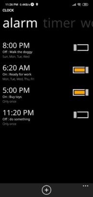

# Metro-Clock-Native

An attempt to create an all-in-one clock app using the design guidelines of Windows 8.1 Metro UI. This is a part of the application suite of a bigger project - Metro OS.

See the [Metro-Browser-Native](https://github.com/god-s-perfect-idiot/metro-browser-native) project for now until I make a proper README for this clock app.

Follow the instructions given there.

## Demo screenshots:

